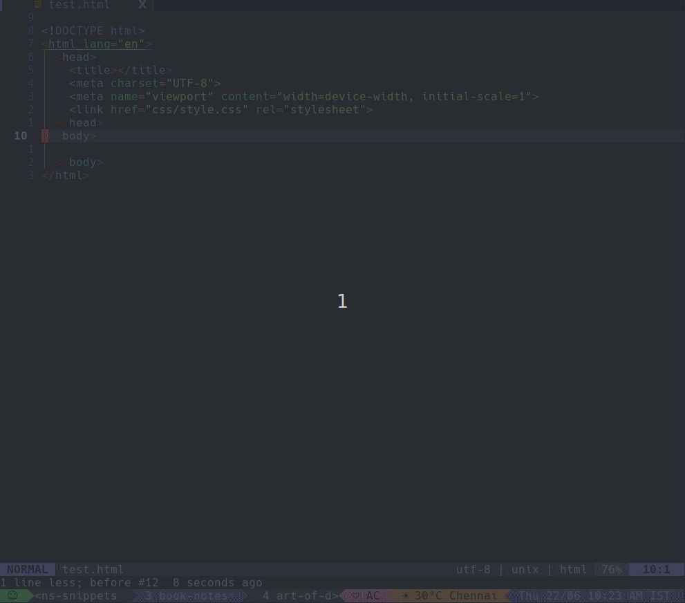
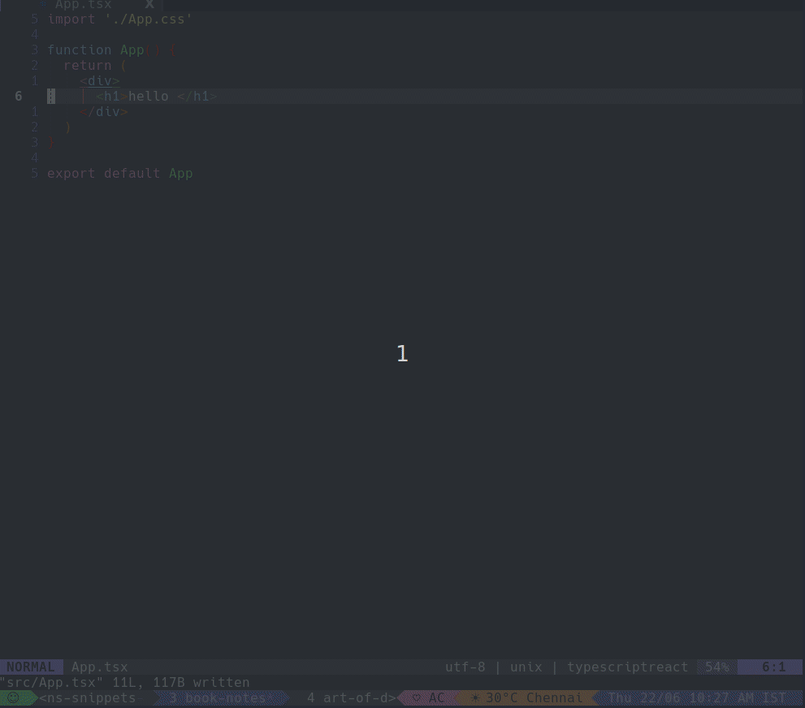

# crayons snippets
Snippets for [Freshworks Crayons Components](https://crayons.freshworks.com)


## Demo
[Youtube](https://youtu.be/4kSZlCCuEq4)

## Install

Use your plugin manager of choice, e.g.

### With Lazy.nvim

```lua
{ "rajasegar/crayons-snippets" }
```

> **Warning**: If you're using LuaSnip make sure to use
> `require("luasnip.loaders.from_vscode").lazy_load()`, and add
> `crayons-snippets` as a dependency for LuaSnip, otherwise snippets might not
> be detected. If you don't use `lazy_load()` you might notice a slower
> startup-time
>
> ```lua
> {
>   "L3MON4D3/LuaSnip",
>   dependencies = { "rajasegar/crayons-snippets" },
> }
> ```

### With Packer

```lua
use "rajasegar/crayons-snippets"
```

### With vim-plug

```vim
Plug "rajasegar/crayons-snippets"
```

### With coc.nvim

```vim
:CocInstall https://github.com/rajasegar/crayons-snippets@main
```

## Usage

This collection of snippets should work with any snippet engine that supports
loading vscode snippets. Like for example:

- [vim-vsnip](https://github.com/hrsh7th/vim-vsnip)
- [LuaSnip](https://github.com/L3MON4D3/LuaSnip)
- [coc-snippets](https://github.com/neoclide/coc-snippets)


## Showcase

### HTML



### React



## TODO


